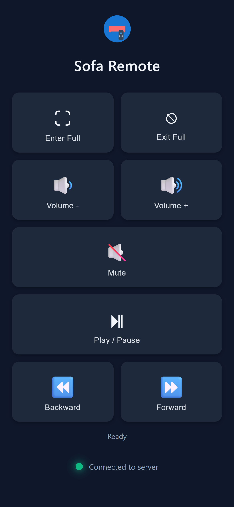

# 🛋️ Sofa Remote

A Windows system tray application that turns your phone into a wireless remote control for media playback. Control your PC's media from the comfort of your sofa!

<div align="center">

### 📱 Phone Interface



*Modern, touch-optimized controls with real-time connection monitoring*

</div>

## ✨ Features

### 📱 Progressive Web App (PWA)
- **Install on any device** - Works on iPhone, Android, and desktop browsers
- **Offline-ready** - Cached for instant loading
- **Native app experience** - Add to home screen for full-screen usage

### 🎮 Media Controls
- **Play/Pause** - Control media playback
- **Volume** - Volume up, down, and mute
- **Seek** - Fast forward and rewind (←/→ arrow keys)
- **Fullscreen** - Enter (F key) and exit (ESC key) fullscreen mode

### 🔌 Smart Connection
- **Real-time status** - Visual connection indicator with health checks
- **Auto-reconnect** - Graceful handling of disconnections
- **Multi-device support** - Access from any device on your local network

### 🎨 Modern Interface
- **Material Design** - Clean, intuitive UI with ripple effects
- **Dark theme** - Easy on the eyes
- **Responsive** - Optimized for mobile and tablet screens
- **Touch-optimized** - Designed for finger-friendly interactions
- **Wake Lock** - Keeps screen on while using (iOS & Android)
- **Auto-install popup** - Smart PWA installation prompt

## 🚀 Quick Start

### Installation

#### Option 1: Installer (Recommended)
1. **Download** `SofaRemote-Setup-2025.12.27.1.exe` from the [Releases](../../releases) page
2. **Run** the installer
3. **Choose** installation options:
   - Desktop shortcut (optional)
   - Launch at Windows startup (optional)
4. **Launch** from Start Menu or Desktop
5. The app will appear in your system tray

#### Option 2: Portable
1. **Download** `SofaRemote-Portable.zip` from the [Releases](../../releases) page
2. **Extract** to any folder
3. **Run** `SofaRemote.exe` - it will appear in your system tray

### Using the App

1. **Click** the tray icon to see the QR code
2. **Scan** the QR code with your phone to open the web interface

### Network Setup

**First-time users:**
- Right-click the tray icon
- Select "Restart as Admin (Fix LAN)" to configure network permissions
- This adds firewall rules and URL ACL for LAN access

### Phone Setup

#### iOS (iPhone/iPad)
1. Open Safari and navigate to the displayed URL
2. Tap the **Share** button (↑)
3. Select **Add to Home Screen**
4. Tap **Add**
5. Launch from your home screen!

#### Android
1. Open Chrome and navigate to the displayed URL
2. Tap **Install** when prompted
3. Or tap the menu (⋮) → **Add to Home Screen**
4. Launch from your home screen!

## 🛠️ How It Works

### Architecture

```
┌──────────────┐         HTTP/8080        ┌──────────────┐
│              │◄────────────────────────►│              │
│   Phone      │    POST /playpause       │   Windows    │
│   Browser    │    POST /volup           │   PC App     │
│   (PWA)      │    GET  /health          │   (Tray)     │
│              │                           │              │
└──────────────┘                           └──────────────┘
       │                                          │
       │                                          │
       ▼                                          ▼
 Service Worker                          Windows API
 Offline Cache                           keybd_event()
 Wake Lock                               SetForegroundWindow()
```

### Technical Stack

- **.NET 8** - Windows Forms tray application
- **HttpListener** - Lightweight HTTP server (port 8080)
- **Windows API** - Direct keyboard input injection via `user32.dll`
- **QRCoder** - QR code generation for easy mobile access
- **Progressive Web App** - Modern web app with offline support

### Key Technologies

#### Backend (C#)
- Single-file architecture (~900 lines in `Program.cs`)
- System tray integration with context menu
- Multi-IP binding with automatic fallback
- Automatic network permission configuration
- Browser window focusing for fullscreen/seek controls

#### Frontend (PWA)
- Vanilla JavaScript (no framework dependencies)
- Service Worker with auto-update and version management
- Wake Lock API (Android) + Silent audio fallback (iOS)
- Material Design animations and ripple effects
- Connection health monitoring (3-second intervals)
- Smart install popup with platform detection
- Automatic cache invalidation on version changes

## 📋 Requirements

- **OS**: Windows 10/11 x64 (version 10.0.19041.0 or higher)
- **Network**: Local network (Wi-Fi/Ethernet)
- **Port**: TCP port 8080 (configurable in source)
- **.NET**: ✅ Not required - .NET 8 runtime included in all builds

## 🔧 Building from Source

### Prerequisites
- .NET 8 SDK
- Windows 10 SDK (10.0.19041.0)
- Inno Setup 6 (for creating installers)

### Build Steps

```powershell
# Clone the repository
git clone https://github.com/lilsid/SofaRemote.git
cd SofaRemote

# Build and create installer (automated)
powershell -ExecutionPolicy Bypass -File .\build.ps1
```

This creates:
- **Single-file build**: `publish\single-file\` (170 MB all-in-one exe)
- **Installer**: `publish\installers\SofaRemote-Setup-2025.12.27.1.exe`

### Manual Build

```powershell
# Run from source
dotnet run

# Or build single-file executable
dotnet publish -c Release -r win-x64 --self-contained true -p:PublishSingleFile=true -o .\publish\single-file
```

See [BUILD_GUIDE.md](BUILD_GUIDE.md) for detailed build instructions.

## 📖 Usage
Beautiful QR code window with all access URLs
- **Restart as Admin (Fix LAN)** - Configure network permissions
- **Exit** - Close the application

### QR Code Window
- Clean, modern design with proper spacing
- White background for better QR code scanning
- Primary URL highlighted in blue
- All available network addresses listed
- Press ESC to closeth access URLs
- **Restart as Admin (Fix LAN)** - Configure network permissions
- **Exit** - Close the application

### Web Interface
Access from any browser on your network:
- **Primary URL**: Shown in QR code window
- **Localhost**: `http://localhost:8080/` (same PC only)
- **LAN Access**: `http://YOUR_IP:8080/` (any device on network)

### Keyboard Shortcuts
The app sends these keyboard events to control media:
- **Play/Pause**: Media Play/Pause key (0xB3)
- **Volume Up**: Volume Up key (0xAF)
- **Volume Down**: Volume Down key (0xAE)
- **Mute**: Volume Mute key (0xAD)
- **Forward**: Right Arrow key (with browser focus)
- **Backward**: Left Arrow key (with browser focus)
- **Enter Fullscreen**: F key (with browser focus)
- **Exit Fullscreen**: ESC key

## 🔒 Security

- **Local network only** - No internet exposure
- **No authentication** - Designed for trusted home networks
- **No data collection** - Everything runs locally
- **No external dependencies** - Self-contained application

**⚠️ Security Note**: This app is designed for home use on trusted networks. Do not expose port 8080 to the internet.

## 🐛 Troubleshooting

### Phone can't connect
- Ensure phone and PC are on the same Wi-Fi network
- Run "Restart as Admin (Fix LAN)" from tray menu
- Check Windows Firewall settings for port 8080
- Try accessing `http://localhost:8080/` from PC browser first

### Fullscreen/Seek not working
- These controls require browser window focus
- App auto-focuses Edge, Chrome, Firefox, Brave, or Opera
- Wait 200ms after pressing for browser to focus
- Ensure media is playing in the browser

### "Server Disconnected" overlay
- Check if SofaRemote.exe is running 

### Page shows black/white screen on phone
- Clear browser cache and reload
- Use Private/Incognito mode
- Delete and reinstall PWA from home screen
- Service worker cache will auto-update on version change

### Wake lock not working
- **Android/Desktop**: Uses native Wake Lock API (tap any button to activate)
- **iOS**: Uses silent audio loop (requires user interaction to start)
- iOS will still dim/lock after extended inactivity (iOS power management)
- Adjust Auto-Lock setting in iOS Settings → Display & Brightness(system tray)
- Verify network connectivity
- App checks health every 3 seconds with 2-second timeout

### Controls not responding
- 400ms debounce prevents rapid duplicate commands
- Wait briefly between button presses
- Check app is running in system tray

## 📝 Logs

Logs are stored at:
```
%LOCALAPPDATA%\SofaRemote\sofa_remote.log
```

View logs to troubleshoot connection or permission issues.

## 🤝 Contributing

Contributions are welcome! Please feel free to submit a Pull Request.

###x] Wake lock support (iOS & Android)
- [x] Service worker auto-update
- [x] Smart install popup
- [x] Improved QR window design
- [ Development Guidelines
- Keep everything in a single `Program.cs` file
- Maintain the self-contained architecture
- Test on both iOS and Android browsers
- Ensure PWA installation works properly

## 📄 License

MIT License - see [LICENSE](LICENSE) file for details.

## 🙏 Acknowledgments

- **QRCoder** - QR code generation library
- **Material Design** - Design inspiration
- **Progressive Web Apps** - Modern web app capabilities

## 🔮 Roadmap

Potential future enhancements:
- [ ] Customizable keyboard shortcuts
- [ ] Multiple device profiles
- [ ] Media position slider
- [ ] Now playing display
- [ ] Dark/light theme toggle
- [ ] Configuration UI
- [ ] Multiple port support
- [ ] HTTPS support

## 📞 Support

- **Issues**: [GitHub Issues](../../issues)
- **Discussions**: [GitHub Discussions](../../discussions)

---

**Made with ❤️ for couch potatoes everywhere** 🛋️🍿
